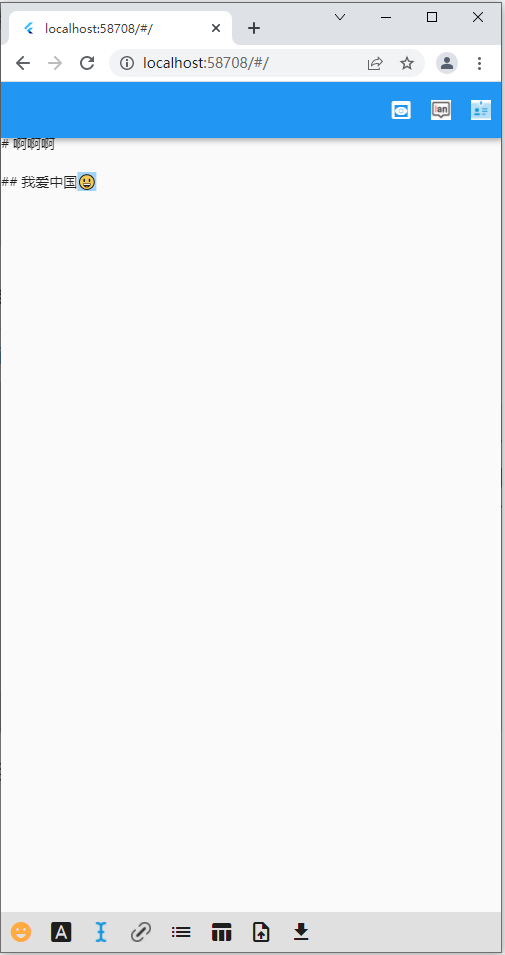
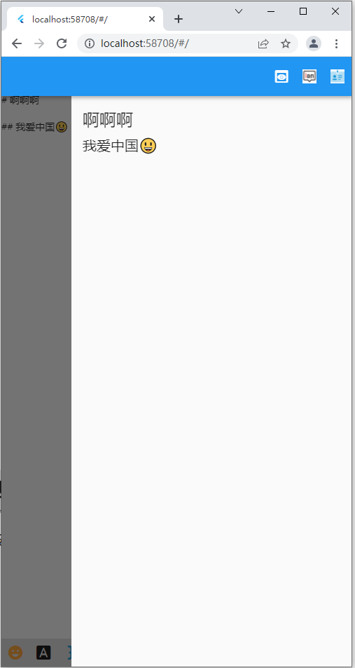
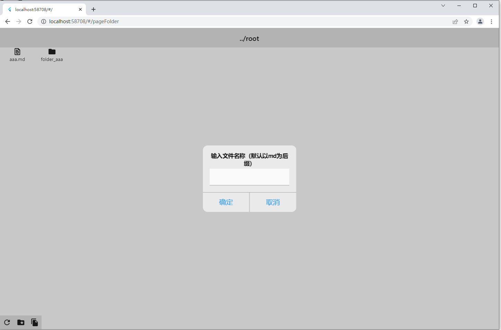
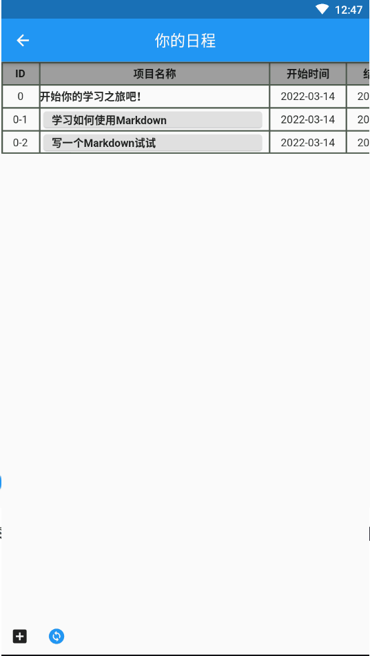

# flutter 的多端适配

楔子：flutter 在 2.0版本以后对web端以及windows,mac os和linux的支持力度加大，flutter包管理[网站](https://pub.flutter-io.cn/)上支持多端适配的工具包也越来越多，并且flutter官网也增加了对嵌入式支持的[介绍页面](https://flutter.dev/multi-platform/embedded)。

## 1. 为什么要做多端适配

”一套代码，多端适用“总归是一个极好的解决方案，谁不想写一份代码收全平台（android，web，windows，linux，iOS，mac，嵌入式）的钱呢（尽管我对钱不感兴趣，技术才是有长期价值的）。

支持多端适配的不仅仅有flutter，JS的多端适配能力也是OK的（electron，react-native等）。但是我个人尝试了react之后，对js做的多端适配是没有正面评价的。倒不是说js语法有多难，react框架有多难，主要是第三方UI库太杂乱，自定义UI组件难度太大，对于新手来说不友好；反而flutter，因为本身封装了大量可自定义的组件，使得定制化程度不高的应用可以信手拈来，熟悉语法之后上手基本没什么难度。

## 2. 怎么用flutter做多端适配

先给几张图看一下。

### 2.1 web端（主页面），通过```flutter build web``` 打包即可，不过这之前要确保flutter支持web。打包完成之后可以用nginx代理发布一下，除开第一次加载较慢之外，和别的网站无异。可以参考这个[页面](https://dartingowl.com/domind/web/#/)


当我改变尺寸的时候，可以自动进行页面样式修改

| 图片1                                                        |                            图片2                             |
| ------------------------------------------------------------ | :----------------------------------------------------------: |
|  |  |

#### 在web端的一个简易的markdown编辑器（目标是超vscode赶typora,因为后者收费了）


左边是书写的地方，右边是预览的地方（与vscode一致，不过我加了很多便捷的功能，以至于我觉得我至少比vscode强一丢丢）。


vscode不支持插入 emoji吧，但是我可以，而且还有很多。

不过在代码样式渲染上，这个编辑器是比不过vscode的；包括typora，我觉得也是比不过vscode。


这里有一个```下载到本地```的按钮，就涉及到多平台适配，简单地说，web端可以下载编写好的markdown文件到本地，而android,iOS,windows等则是保存到本机app目录下（这个功能我还没实现，只实现了web端下载。能下载自然能上传以及打开一个现成的markdown文件，但是我也暂时没做😃）


退出会有提示，用的是iOS风格的dialog，这个对话框是flutter自带的。事件是点击浏览器的返回按钮触发，



尺寸适配自然少不了，预览移动到了右上角 appbar 的actions按钮群中了。



预览页面。

#### web端一个甘特图日程表页面


这里的日程表在web端渲染很慢（会有明显的卡顿，差不多一秒钟左右），主要原因还是浏览器本身不适合渲染较为复杂的页面，为了浏览器端性能，我去掉了很多功能，比如说右侧布局中间正方形上面的悬停事件。这个在windows页面展示的时候会给大家看效果。


点击左下角蓝色的加号，就可以改变布局比例。


拉扯一下。

因为每次点击按钮都会重绘全局页面，所以很多消耗性能的操作都不适合在web端实现，在写代码的时候要注意。


点击右上角可以切换显示，本身是一年365天以小格子的样式排列，现在用Gantt图显示（稍微有点不太好看，但是基本功能都有，比如超时的时候用红色显示）

#### web端文档管理页面


一个简单的文档管理页面，我觉得我写的代码很烂，但是能正确运行，想改的时候反而改不好了。



创建一个文件，后续应该是直接连数据库的。我这里考虑的是，文件存储时保存文件和逻辑路径，然后在渲染的时候通过逻辑路径渲染。

#### 最近还在搞一个脑图


这个页面支持拖拽，滚轮事件（放大缩小）,这些都是flutter页面自带的组件支持。绘图逻辑我是抄的别人现成代码，因为所有关于物理变换、动画以及绘图的逻辑都不是很擅长。

以上是web端的介绍。

### 2.2 windows 页面介绍

#### 这里着重讲一下 windows 上和web端供能的差异点。使用指令```flutter config --enable-windows-desktop```支持windows构建，使用指令``` flutter build windows```就可以打包windows的可执行程序，不过需要装 visual studio2019以上版本。windows上用flutter构建的最典型的应用：网易云音乐（le,第四声）。

#### 


整个windows上打包完成的包只有25M，远远小于electron不做优化的打包大小。当然，还是比不上c#写的原生windows打包大小。


和web端不同的是，windows上最多可以拖拽到这么小。


刚忘记讲了，这个应用支持本地化。


因为windows上没有浏览器自带的返回键，所以这里针对平台添加了一个返回按钮。安卓上也有，不过安卓有手势互动，底部回退等方式回退。


这个页面打开速度是远远快于web端的，同时由于桌面应用渲染效率高，这里每个格子都包裹了```ToolTip```组件，鼠标悬停的时候就能看到日期。


我来回切换，哪怕是每一次都重绘整个页面，整体的内存和cpu占用都很小，看看谷歌浏览器，后台什么都没在干都耗了十倍以上的内存。

### 2.3 android 上的区别


web以及windows上，横向的滚动条都不能正常运作，我不确定这是不是bug，只有移动端可以这样滚动。



移动端是支持横竖屏切换的，但是我的模拟器抽了，切换的不太对劲。因为右侧（像是github那一边的页面）滚动条有联动，就是滚动上面的日期，下面12个月的滚动条也要同步滚动，所以渲染起来会有些吃力。

### 2.4 其他

其他平台我没做过对比，linux上应该和windows差不多，iOS和mac上我没有设备。