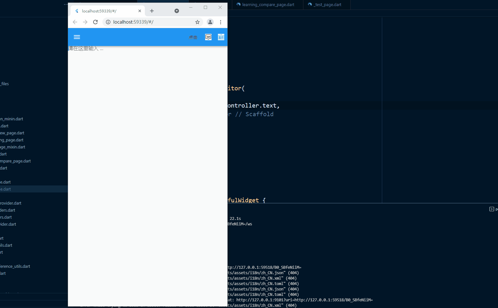

<!--
 * @Descripttion: 
 * @version: 
 * @Author: xiaoshuyui
 * @email: guchengxi1994@qq.com
 * @Date: 2022-01-31 21:06:54
 * @LastEditors: xiaoshuyui
 * @LastEditTime: 2022-02-02 17:17:28
-->
# code-find

## 一个用来搜索解决方案、文档归档的个人项目。中文名暂定“书鱼”，取“读书之人，需学会有效摸鱼”之意。英文缩写“codind”.

#

# [前端说明](./frontend/codind/README.md)

# [后端说明](./backend/README.md)

# 部分演示demo

