<!--
 * @Descripttion: 
 * @version: 
 * @Author: xiaoshuyui
 * @email: guchengxi1994@qq.com
 * @Date: 2022-01-31 21:06:54
 * @LastEditors: xiaoshuyui
 * @LastEditTime: 2022-04-18 20:50:23
-->
# a-cool-app

The coolest thing is build an app on your own!

### 我的目标是做一个personal知识库，同时做到创建文档，管理文件以及分享心得。并且，最coooool的地方在于，all platforms, everywhere。

## [前端说明](./frontend/codind/README.md)

## [后端说明](./backend/README.md)

## [多端适配说明](./frontend/multi_platform_support.md)

# 开发平台 

Windows 10

# 详细配置

```
设备名称	MSI
处理器	Intel(R) Core(TM) i7-10750H CPU @ 2.60GHz   2.59 GHz
机带 RAM	16.0 GB (15.8 GB 可用)
设备 ID	********
产品 ID	********
系统类型	64 位操作系统, 基于 x64 的处理器
笔和触控	没有可用于此显示器的笔或触控输入
```

# 页面介绍（web端用于展示，支持全平台）

## 1. 登录

|  | login page的样式是用了开源的[仓库](https://github.com/NearHuscarl/flutter_login),稍做了修改，<br>支持国际化（通过[provider](https://github.com/rrousselGit/provider)状态管理） |
| :----------------------------------------------------------- | :----------------------------------------------------------- |

> 这里不是特别想通过手机号验证码、第三方登录然后乱拿一些个人信息登录，一个是麻烦，人家做的功能就不支持三方登录，第二个是这些信息没有什么意义，第三个是采用邮箱、密码登录，开发后端成本比较低，也不需要向各个运营商申请资质。
>
> 而且我觉得大部分功能都可以在前端完成，所以在右上角加了离线模式的switch，并且内置了账号密码。


不得不说，登录特效相当酷炫。

## 2. 首页

|  | 首页是包裹在一个NestedScrollView组件中，<br>当前图中所示的整个是NestedScrollView顶部的headerSliverBuilder，<br>右侧的三角形点击之后可以收起整个SliverAppBar<br>body部分是一个ListBuilder，这里通过provider以及缓存控制展示的内容，默认为空 |
| ------------------------------------------------------------ | ------------------------------------------------------------ |


> 首页想展示的内容包括个人基础信息、制定计划（通过Notification以及数据库实现，当前Notification暂时只支持Android以及iOS）数量以及完成情况、设置按钮、顶部的每日热点话题，用于开早会的时候扯个皮以及打卡。打卡的话我想的是搞一个动态的gif，例如养个数字的树啊，宠物什么的，打个卡（暂时还没有实现）。
>
> 收起之后展示appbar，收起的时候头像旋转，也是通过provider实现的。这里说一句，provider可以用在StatelessWidget组件中，每次变动都会重新build一次，不过一般情况下流畅度还是可以保障的。

## 3. 偏好设置

|  | *偏好设置* 按钮点击之后跳转的页面。<br>*账号与安全* 点击后可以设置账号相关信息，包括选择头像<br>*选择语言* 就是国际化，当前是部分页面部分组件实现了中英文国际化<br>*管理首页内容* 就是设置首页NestedScrollView body部分展示的列表<br>*退出登录* 会清空缓存，然后清空页面栈退到登陆页面 |
| ------------------------------------------------------------ | ------------------------------------------------------------ |

### 3.1 管理首页内容页面

|  | 这里只是单纯的Scaffold组件<br>顶部是自定义的appbar(PreferredSize)<br>中间的头像点击之后就跳转到修改头像页面 |
| ------------------------------------------------------------ | ------------------------------------------------------------ |

### 3.2 修改头像

|  | 头像生成器采用的也是开源的方案 [dicebear](https://avatars.dicebear.com/docs/http-api)<br>github有其开源的仓库，可以自己搭建服务 |
| ------------------------------------------------------------ | ------------------------------------------------------------ |


> 头像这边是支持png以及svg两种格式的，但是两者都有一点问题。
>
> png的图像，接口访问的时候不支持背景色，所以背景色是我后续自己添加的；svg的图片，在web端渲染有bug，我在这里自己写了xml解析重新对svg的数据进行了处理。
>
> 这里也还是使用了全局的provider,这里的头像发生变化同时，也随即影响到了首页以及前一个页面。
>
> ***关键字*** 不支持中文（虽然我写了中文，但是生成的完全和中文输入的没有任何关系）也是蛮讨厌的

### 3.3 国际化

|  |  |
| ------------------------------------------------------------ | -------------------------------------- |

> 国际化，不多赘述了。用的是 ```flutter_i18n```这个库。
>
> 不过，可能因为我本地 kotlin版本的问题，使用```flutter_toast```这个包的时候，打包release的时候会出错，包括```package_info_plus```这个包也有问题。所以我用了```flutter_smart_dialog```这个包来做toast功能。这就涉及到一个问题，就是```flutter_smart_dialog```需要全局配置，而i8n也需要全局配置，导致了全局配置的时候出了点小麻烦...所以，直接上解决方案。
>
> ```dart
> MaterialApp(
>     scrollBehavior: !PlatformUtils.isMobile
>     ? MyCustomScrollBehavior()
>     : const MaterialScrollBehavior(),
>     routes: Routers.routers,
>     debugShowCheckedModeBanner: false,
>     builder: (context, child) {
>         return FlutterSmartDialog(
>             child: FlutterI18n.rootAppBuilder().call(context, child));
>     },
>     home: LoginScreen(),
>     navigatorObservers: [FlutterSmartDialog.observer],
>     localizationsDelegates: [
>         getI18n(context.watch<LanguageControllerV2>().currentLang),
>         GlobalMaterialLocalizations.delegate,
>         GlobalWidgetsLocalizations.delegate
>     ],
>     navigatorKey: Global.navigatorKey,
> )
> ```
>
> 注意，我这里 builder 中将两个模块的初始化方法都糅合在一起了。坑的地方是什么呢？
>
> |  |  |  |
> | ------------------------------------------------------------ | ------------------------------------------------------------ | ------------------------------------------------------------ |
>
> > 可以看到，MaterialApp builder方法中接受的参数是一个 Function,这本来没什么问题，毕竟 ```FlutterI18n.rootAppBuilder()```这个方法就已经满足条件了(单纯使用FlutterSmartDialog的话是调用```FlutterSmartDialog.init()```方法)，但是要同时支持两个模块，就必须让他嵌套到另一个模块里，作为一个子widget，思来想去，只能通过 ```Function.call()``` 这种写法完成如是操作。
> >
> > 我是没想到还有没有别的更***优***的解决方案，但我不得不说一句，还好dart里都是对象，```Function```还实现了```call()```这个方法。

### 3.4 管理首页内容

|  |  |
| ------------------------------------------------------------ | -------------------------------------- |

> Of course , provider实现全局状态共享（多选）,缓存实现恢复页面状态的功能。
>
> 这里，使用的缓存是```shared_preferences```这个包，它获取缓存时是异步的方式（async await），所以不能在build方法中使用；同时，如果是FutureBuilder的话，也会很麻烦。推荐一种用provider的写法。
>
> ```dart
> ChangeNotifierProvider(
>    create: (_) => MainPageCardController()..init(),
> ),
> ```
>
> 在初始化provider的时候，给一个init()方法，这个方法可以是异步的，像这样。
>
> ```dart
> Future init() async {
>  PersistenceStorage ps = PersistenceStorage();
> 
>  List<String> l = await ps.getMainpageCardTitles();
> 
>  for (var i in l) {
>    if (selectedCard.containsKey(i)) {
>      selectedCard[i] = true;
>    }
>  }
> 
>  notifyListeners();
> }
> ```
>
> dart中的“..”运算符叫做级联运算符，是一种便利的写法，某些时候可以简化代码。和“.”运算符不一样的是，级联运算符的输出（可以看成是输出，其实更多的可以当作完成了赋值或者初始化操作，所以返回值和原数据类型是一致的）和“.”运算符是不一样的，打个比方：
>
> ```dart
> class Person {
>   int? age;
>   String? name;
> 
>   Person({this.age, this.name});
> 
>   void setAge(int a) {
>     age = a;
>   }
> 
>   void setName(String n) {
>     name = n;
>   }
> }
> 
> // 这是一个简单的类，通过name和age来构造一个person
> // 我们有多种方式可以给这两个参数赋值，先来看看级联是怎么
> // 完成的
> 
> // 级联赋值1
> Person p = Person()
>     ..age = 18
>     ..name = "Dart";
> // 可以看到通过级联运算符直接在声明对象的时候直接对对象赋值了
> 
> // 级联赋值2
> Person p2 = Person()
>     ..setAge(17)
>     ..setName("flutter");
> // 因为我们定义了 set 方法，所以也可以直接这样赋值
> 
> // 但是 "." 运算符就不行，因为set方法返回值不是一个
> // person类型，而是 void
> // Person p3 = Person().setAge(19); 的时候就会报错
> 
> /*
> void setAge(int a)
> 
> This expression has a type of 'void' so its value can't be used.
> Try checking to see if you're using the correct API; there might be a function or call that returns void you didn't expect. Also check type parameters and variables which might also be void
> 
> */
> ```
>
> 
>
> 这种写法也广泛用于bloc的状态初始化。
>
> > 本app中也是有用到```bloc```的，并且一开始provider使用的场景很少，因为bloc更适合于复杂的场景，provider则可以用于简单的状态共享。这里也就涉及到另一个问题，怎么设置全局的Providers以及全局的bloc呢？
> >
> > 这里提供一种思路，未必是最优的。
> >
> > （1）main.dart这样定义：
> >
> > ```dart
> > Future main() async {
> > debugPrint(
> >    "use username= `test@xiaoshuyui.org.cn` &  password= `123456` to test");
> > 
> > 
> > WidgetsFlutterBinding.ensureInitialized();
> > // 这里执行一些初始化插件操作
> > 
> > 
> > 
> > BlocOverrides.runZoned(
> >    (() => runApp(MultiProvider(
> >          providers: getProviders(),
> >          child: const MyApp(
> >            ...
> >          ),
> >        ))),
> >    blocObserver: SimpleBlocObserver());
> > }
> > ```
> >
> > 我们首先用```BlocOverrides.runZoned()```这个方法包裹```runApp()```方法。```providers```参数就是定义的provider,我这里抽出来放到另一个文件中了：
> >
> > ```dart
> > List<SingleChildWidget> getProviders() {
> > return [
> >  ChangeNotifierProvider(
> >    create: (_) => EmojiController(),
> >  ),
> >  // ... 很多，很多，很多的 provider
> > ];
> > }
> > ```
> >
> > ```SingleChildWidget```这个类需要 ```import 'package:nested/nested.dart';```，单独拿出来vscode不会自动导包（暂时，也许以后支持导入非直接依赖的模块中的包，就好像你依赖了```flutter_bloc```,但是每次用provider都需要手动写```import 'package:provider/provider.dart';```）
> >
> > （2）MyApp中这样定义
> >
> > ```dart
> > class MyApp extends StatefulWidget {
> > const MyApp({Key? key, this.colorList, this.lang}) : super(key: key);
> > // final getI18n flutterI18nDelegate;
> > final List<String>? colorList;
> > final String? lang;
> > 
> > @override
> > State<MyApp> createState() => _MyAppState();
> > }
> > 
> > class _MyAppState extends State<MyApp> {
> > @override
> > void initState() {
> >  super.initState();
> > 
> >  // 这里有很长的 init 逻辑，因为很长所以去掉了
> > }
> > 
> > @override
> > Widget build(BuildContext context) {
> >  return MultiBlocProvider(
> >      providers: [
> >        BlocProvider(
> >          create: (_) => GanttBloc()..add(InitialGanttEvent()),
> >        ),
> >        // ... 有一些 bloc
> >        )
> >      ],
> >      child: MaterialApp(
> >        scrollBehavior: !PlatformUtils.isMobile
> >            ? MyCustomScrollBehavior()
> >            : const MaterialScrollBehavior(),
> >        routes: Routers.routers,
> >        debugShowCheckedModeBanner: false,
> >        builder: (context, child) {
> >          return FlutterSmartDialog(
> >              child: FlutterI18n.rootAppBuilder().call(context, child));
> >        },
> >        home: LoginScreen(),
> >        navigatorObservers: [FlutterSmartDialog.observer],
> >        localizationsDelegates: [
> >          getI18n(context.watch<LanguageControllerV2>().currentLang),
> >          GlobalMaterialLocalizations.delegate,
> >          GlobalWidgetsLocalizations.delegate
> >        ],
> >        navigatorKey: Global.navigatorKey,
> >      ));
> > }
> > }
> > ```
> >
> > 这样就可以同时让两者都全局生效了。

## 4. 每日热点

| 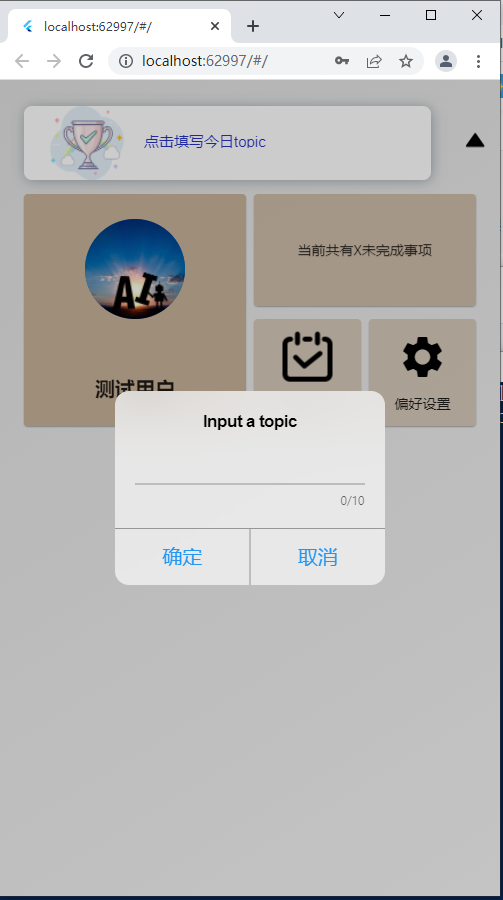 | 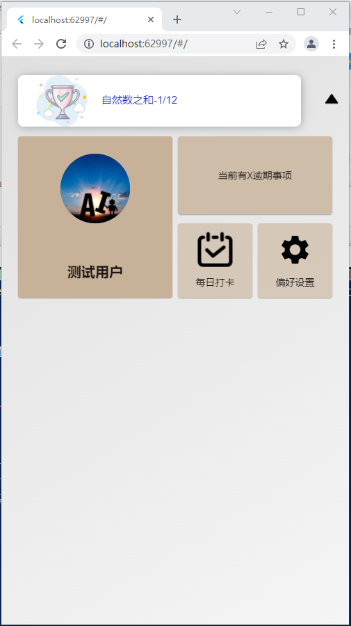 |
| ------------------------------------------------------------ | ------------------------------------------------------------ |

>简单的功能，通过缓存记录修改的时间，每次启动的时候和当前时间对比，如果不是同一天，则显示“输入今日topic”，如果是同一天，则从缓存中拿出存储的topic显示
>
>by the way， 自然数之和是 -1/12 是个很有意思的证明，我看了有点懵逼

## 5. 各模块介绍

首页各个模块拿出来说一说。

### 5.1 创建计划（日程）

| 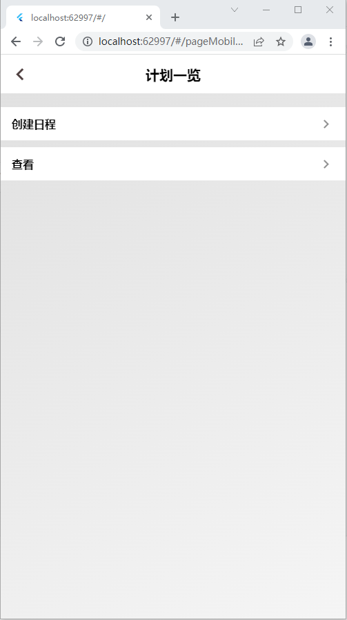 | 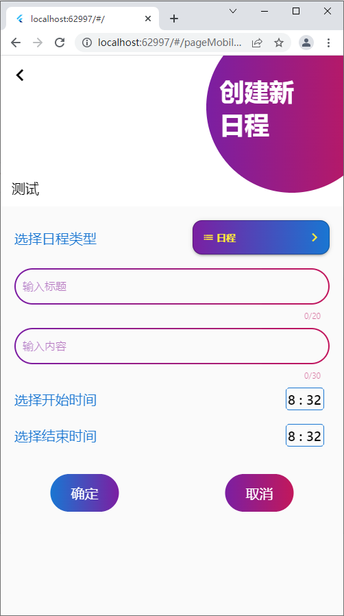 | 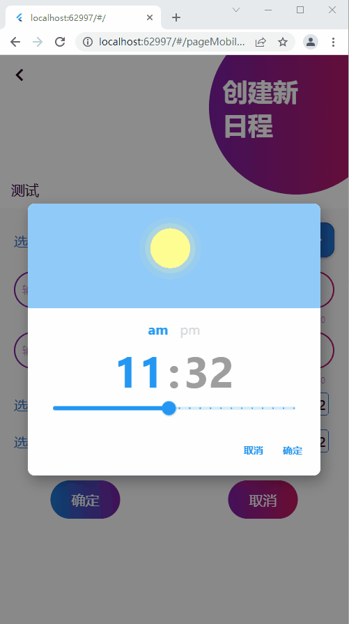 |
| ------------------------------------------------------------ | ------------------------------------------------------------ | ---------------------------------------------------- |

> 这里采用的是 notification完成的，iOS端需要额外做一些配置，Android直接用就行了。不过这一块还没有完全实现。时间选择器还是很花哨的。

### 5.2 能力表

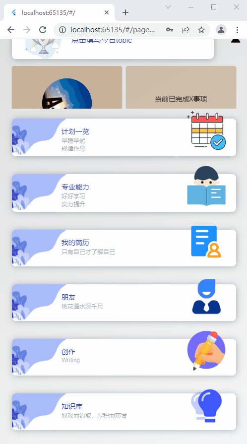

> 这里用到了两个第三方组件，```fl_chart```和```expandable```,用来完成展开时展示图表功能。

### 5.3 简历

| 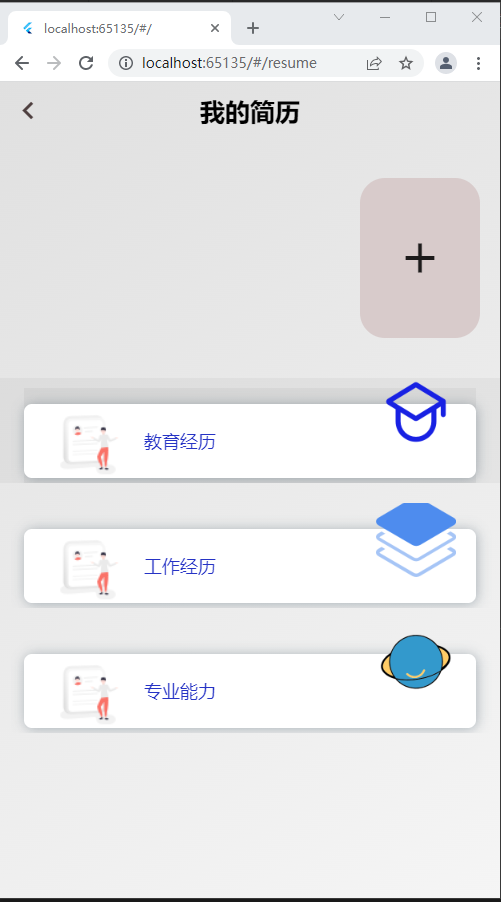 | 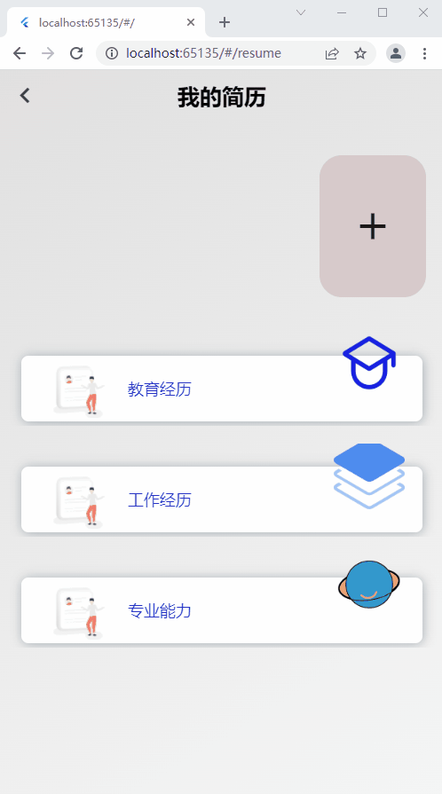 |
| ------------------------------------------------------------ | ---------------------------------------------------- |

> 比较简单的功能，不过现在的```file_picker```模块支持多平台了，开发起来也就简单多了。

### 5.4 friends

| 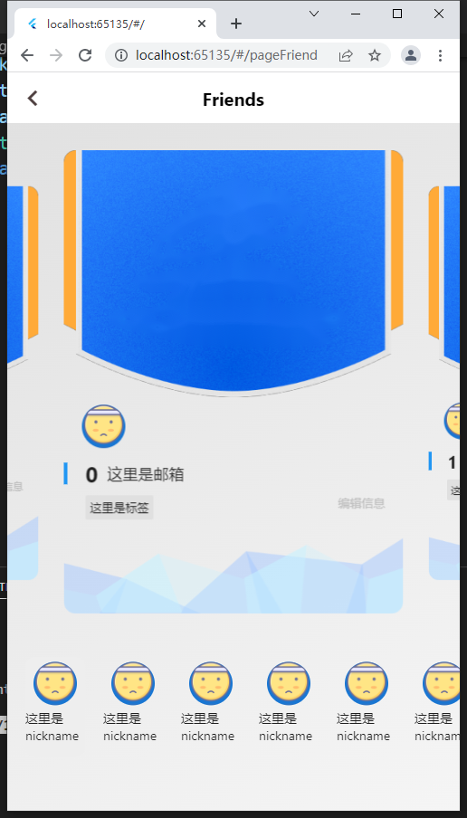 | 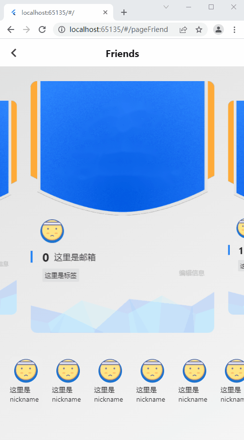 |
| ------------------------------------------------------------ | ---------------------------------------------------- |

> 有一个controller的联动，也是比较简单

### 5.5 知识库

| 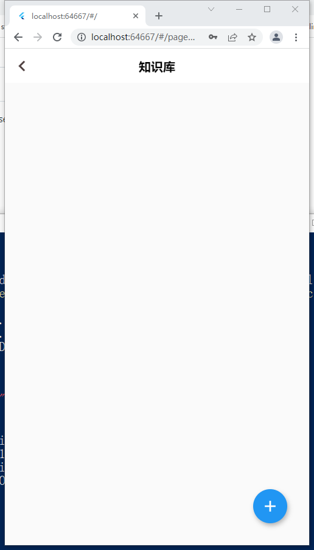 | 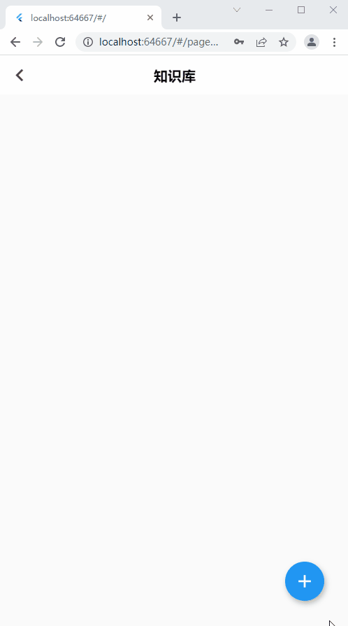 |
| ------------------------------------------------------------ | ---------------------------------------------------- |

### 5.6 markdown 写作

| 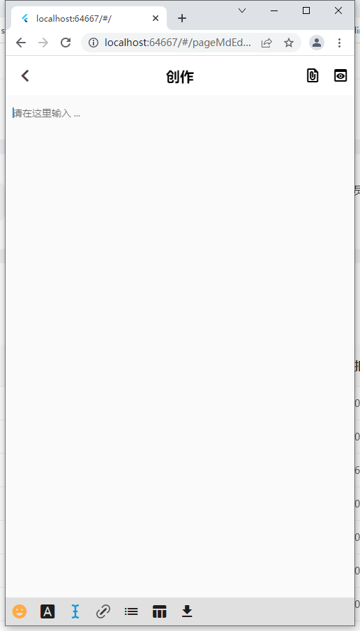 | 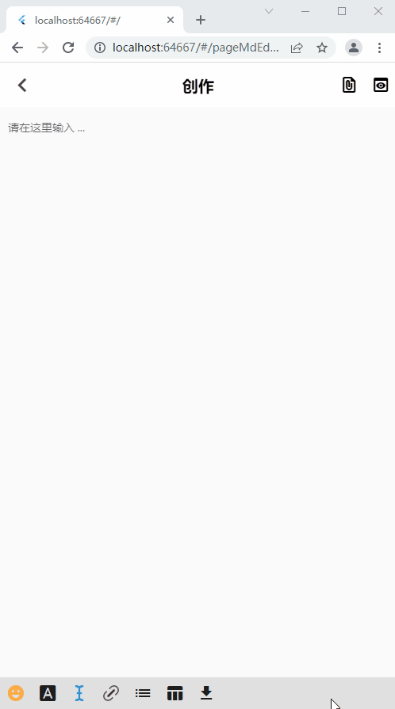 |
| ------------------------------------------------------------ | ---------------------------------------------------- |

> 我一直觉得手机上写代码是可以实现的，连一个键盘，共享一个屏幕，轻轻松松，code everywhere。

### 5.7 其它功能

#### 5.7.1 扫码共享

#### 5.7.2 ...

